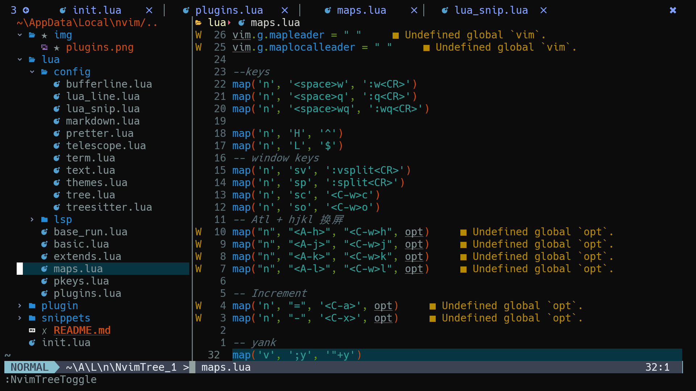
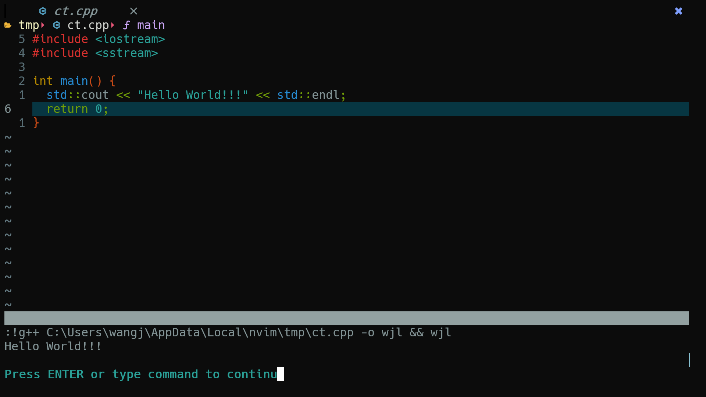
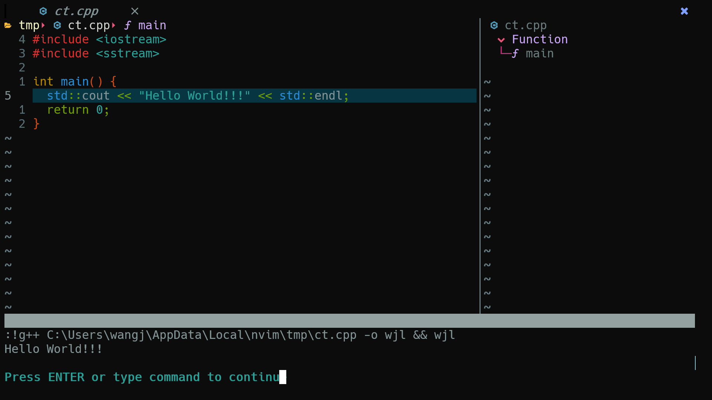

[TOC]
# 目录结构
```bash
.
|-- README.md
|-- init.lua
|-- lua
|   |-- base_run.lua
|   |-- basic.lua
|   |-- config
|   |   |-- bufferline.lua
|   |   |-- lua_line.lua
|   |   |-- lua_snip.lua
|   |   |-- markdown.lua
|   |   |-- pretter.lua
|   |   |-- telescope.lua
|   |   |-- term.lua
|   |   |-- text.lua
|   |   |-- themes.lua
|   |   |-- tree.lua
|   |   `-- treesitter.lua
|   |-- extends.lua
|   |-- lsp
|   |   |-- cmp.lua
|   |   |-- lsp.lua
|   |   |-- lspsaga.lua
|   |   |-- mason.lua
|   |   `-- null_ls.lua
|   |-- maps.lua
|   |-- pkeys.lua
|   `-- plugins.lua
|   
`-- snippets
    |-- package.json
    `-- vscode
        `-- cpp.json
```
# 软件依赖
* node.js
* gcc/mingw64 [链接](https://sourceforge.net/projects/mingw-w64/files/)

# 注意事项
* win系统安装 treesitter
  - 打开管理员窗口 安装 `npm install -g tree-sitter-cli`
  - 设置 - 开发者者设置开启
  - 安装编译工具链 [官方教程](https://github.com/nvim-treesitter/nvim-treesitter/wiki/Windows-support)

# 截图





